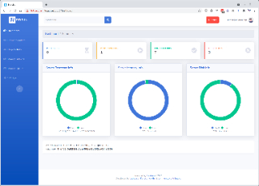
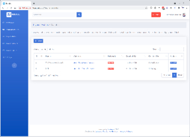
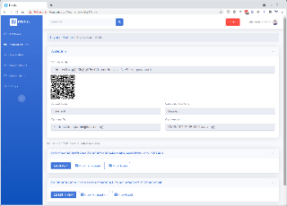
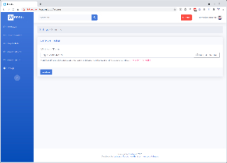

# Heidrun

This is an automation platform for Cardano to trigger various action based on detecting payment to a wallet address. 
It does not require a full Cardano node and relies on [Blockfrost](https://blockfrost.io) to query & submit transactions. 
Works perfectly well on Cardano `testnet` as well as `mainnet` (quite easy to switch between the two).

Currently, this system lets you create wallets and view contents of each wallet, and it can handle two types of jobs via the api & queue system:

#### TrackPaymentAndCallback
When a payment detected in a wallet, it can trigger a webhook callback.

Example api request:
```shell
curl --insecure --location --request POST 'https://localhost:8006/api/v1/job/create' \
--header 'api-access-token: YOUR_API_ACCESS_TOKEN_HERE' \
--header 'Content-Type: application/json' \
--data-raw '{
    "type": "TrackPaymentAndCallback",
    "payment_wallet_name": "MyAwesomeWallet",
    "expected_lovelace": 1513147,
    "callback": {
        "request_url": "https://enk9723u6xrh.x.pipedream.net",
        "request_type": "post",
        "request_params": {
            "session_id": "asdasdsads",
            "profile_id": "a1sdads"
        }
    }
}
'
```

#### TrackPaymentAndDropAsset
When a payment detected in a wallet, it can drop a native asset to a receiver's wallet address.

Example api request:
```shell
curl --insecure --location --request POST 'https://localhost:8006/api/v1/job/create' \
--header 'api-access-token: a3pHN3ZiXMa5,!ZU' \
--header 'Content-Type: application/json' \
--data-raw '{
    "type": "TrackPaymentAndDropAsset",
    "payment_wallet_name": "Gifts",
    "drop_wallet_name": "MyDrops",
    "expected_lovelace": 2716755,
    "drop": {
        "policy_id": "dcc407a706ed1fbcbc2304b340b65c970371d41c135f0bc75b2ec562",
        "asset_name": "LatheesanTestCoin",
        "quantity": 20,
        "receiver_address": "addr_test1qp2t365a9pz4vcper0rr43vrxzeyky96rmgpxkeertyp6gt6jeraypygwzs8ymmcvgvx8cphjlwp0w2xguarthk5ta6sey2d75"
    }
}
'
```

#### Example api responses

Example success response:
```json
{
    "code": 201,
    "status": "Created",
    "data": {
        "message": "Job successfully created & scheduled",
        "job_id": 11
    }
}
```

Example error response:
```json
{
    "code": 400,
    "status": "Bad Request",
    "data": "Insufficient asset quantity \"dcc407a706ed1fbcbc2304b340b65c970371d41c135f0bc75b2ec562.LatheesanTestCoin\" in the drop wallet, cannot drop 2000000 because there are only 99950 left"
}
```

### Application GUI Screenshots

[](https://raw.githubusercontent.com/adosia/Heidrun/main/screenshots/dashboard.png)
[](https://raw.githubusercontent.com/adosia/Heidrun/main/screenshots/payment-wallets.png)
[](https://raw.githubusercontent.com/adosia/Heidrun/main/screenshots/payment-wallet-info.png)
[](https://raw.githubusercontent.com/adosia/Heidrun/main/screenshots/settings.png)

### Minimum Requirements

* Linux VPS with at least 1 GB RAM
* Docker

> Tested well on latest Ubuntu operating system, using 1 GB RAM and 2 GB SWAP

### Local/Development Installation

1. Clone the repo with: `git clone git@github.com:adosia/Heidrun.git && cd Heidrun`
2. Generate new self-signed ssl certificates with: `make self-signed-ssl` 
3. Copy `env/mysql.example` as `env/mysql` and `env/web.example` as `env/web` and modify the values as required
4. Build & run the app with: `make build`
5. Visit https://localhost:8006 to access the application and https://localhost:8006/horizon to view the queue

### Available `make` Commands

* `build` Rebuild all docker containers
* `up` Restart all docker containers
* `down` Shutdown all docker containers
* `composer-install` Run composer install
* `db-migrate` Run database migration(s)
* `db-refresh` Drop all database tables, re-run the migration(s) with seeds
* `admin-account` Create a new Heidrun admin account
* `status` View the status of all running containers
* `logs` View the logs out of all running containers
* `shell` Drop into an interactive shell inside _heidrun-web_ container
* `stats` View the resource usage of all running containers
* `artisan` Execute Laravel `artisan` command inside _heidrun-web_ container
* `self-signed-ssl` Generates new apache compatible self-signed SSL certificates

### Switching between `testnet` and `mainnet`

* Edit `env/web` and update `CARDANO_NETWORK` environment variable
  > Possible values are `testnet` or `mainnet`
* Run `make up` to restart the containers with new environment

### Changing mysql root and application's database password

* Edit `env/mysql` and update `MYSQL_ROOT_PASSWORD` and `MYSQL_PASSWORD` environment variables
> If you change `MYSQL_PASSWORD` don't forget to update `env/web` and change `DB_PASSWORD` to match this
* Run `make down` to shut down all containers
* Run `docker volume prune` and select `yes` to delete all volumes
* Run `make up` to start the containers up again

_Note: Sometimes laravel caches application config, so changing the `env/web` and restarting the container isn't enough.
I recommend running `php artisan config:clear` inside the web container using `make shell` command._

### Changing laravel application key

* Run `make shell` and type `php artisan key:generate --show` command
* Copy the output and update `env/web` and change `APP_KEY` environment variable
* Now run `php arisan migrate:fresh --seed` (inside the web container) to drop the database and re-run the migrations and re-seed the admin account